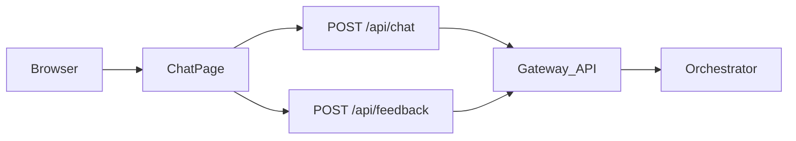

# huntAI

## Design

### Architecture

- **Next.js 15** (App Router) – chat UI + BFF API routes
- **layer-gateway-api-v1 only** – BFF calls `POST /api/chat` and `POST /api/feedback` on the gateway with `Authorization: Bearer …`, and translates gateway SSE (`meta`, `token`, `done`, `error`) into the SSE shape consumed by `app/chat/page.tsx`



### Components

| Component | Purpose |
|-----------|---------|
| `app/chat/page.tsx` | Chat UI; `sessionStorage` session id; `X-Request-Id` / `X-Trace-Id`; optional citations |
| `app/api/chat/route.ts` | Proxies to gateway `/api/chat`; SSE translation for the client |
| `app/api/feedback/route.ts` | Proxies to gateway `/api/feedback` (`trace_id` ← UI `run_id`) |
| `app/lib/config.ts` | `GATEWAY_BASE_URL`, `GATEWAY_BEARER_TOKEN`, `WEB_SERVICE_NAME` (server-only) |
| `app/lib/server-log.ts` | Gateway-style one-line JSON logs from BFF routes (`service` defaults to `huntai-web`) |
| `app/lib/gateway-chat.ts` | Gateway SSE parsing helpers |

### Environment

See [`.env.example`](.env.example).

| Variable | Purpose |
|----------|---------|
| `GATEWAY_BASE_URL` | Gateway origin, no trailing slash (default `http://localhost:8000`) |
| `GATEWAY_BEARER_TOKEN` | Bearer for gateway auth (server-only). Default in code: `demo-token` (stub). Production: set a real JWT. Optional: forward `Authorization: Bearer` on `/api/chat` and `/api/feedback` if unset in env |
| `WEB_SERVICE_NAME` | Optional. JSON log field `service` for Next.js API routes (default `huntai-web`) |

### Gateway contract (curl)

The **example** gateway implementation is **layer-gateway-api-v1** (sibling repo / same workspace). Match its **`docs/smoke-test.md`**: paths, `Authorization: Bearer …` (stub mode accepts any non-empty bearer; local default **`demo-token`**), optional `X-Session-Id` / `X-Request-Id` / `X-Trace-Id` / `X-Conversation-Id`, JSON bodies for `/api/chat` and `/api/feedback`. Replace host/port in smoke examples with your `GATEWAY_BASE_URL` when not on localhost.

## Workflow (in-app)

1. User sends a message → browser `POST /api/chat` with `{ message, conversation_id? }` and optional `X-Session-Id`, `X-Request-Id`, `X-Trace-Id`.
2. BFF → `POST {GATEWAY_BASE_URL}/api/chat` with `Accept: text/event-stream`, `stream: true`, and gateway auth.
3. Client consumes translated SSE (`status`, `result_chunk`, `stream_end`, `error`).
4. Feedback → `POST /api/feedback` on this app → gateway `/api/feedback` with `trace_id` / `request_id` from the chat run.

## End-to-end local run (example gateway)

This app does **not** run an orchestrator. Use **layer-gateway-api-v1** as the reference gateway: configure it with your orchestrator (see that repo’s **README** and **`.env.example`**), then point huntAI at it.

### 1) Run the example gateway (layer-gateway-api-v1)

From the gateway repo (Python **≥ 3.11**):

```bash
cd /path/to/layer-gateway-api-v1
python3.11 -m venv .venv && source .venv/bin/activate   # Windows: .venv\Scripts\activate
pip install -e ".[dev]"
cp .env.example .env   # edit ORCHESTRATOR_* and auth as needed
uvicorn app.main:app --host 0.0.0.0 --port 8000 --reload
```

Sanity-check the gateway (stub auth; align bearer with `GATEWAY_BEARER_TOKEN` below):

```bash
curl -sS -o /dev/null -w "%{http_code}\n" http://localhost:8000/health
# expect 200
```

Optional: follow **`layer-gateway-api-v1/docs/smoke-test.md`** for full `POST /api/chat` and `/api/feedback` curls against `http://localhost:8000`.

### 2) Configure this app

Default BFF target is **`http://localhost:8000`** with bearer **`demo-token`** (same as gateway stub smoke tests). To override:

```bash
cp .env.example .env.local
# set GATEWAY_BASE_URL / GATEWAY_BEARER_TOKEN if needed
```

### 3) Run Next.js

```bash
pnpm install
pnpm test
pnpm lint
pnpm dev
```

Open **http://localhost:3000/chat** — the BFF proxies to **`{GATEWAY_BASE_URL}/api/chat`** and **`{GATEWAY_BASE_URL}/api/feedback`**.

## CI

GitHub Actions runs **`pnpm install` → `pnpm lint` → `pnpm test`** on push/PR (see `.github/workflows/ci.yml`).

## Production build

```bash
pnpm build
pnpm start
```

## Docker

```bash
pnpm docker:build
pnpm docker:run
```

Or: `docker build -t huntai .` then `docker run -p 3000:3000 --env-file .env.local huntai`. App listens on port 3000.
