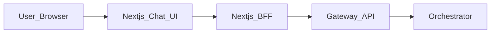

# HuntAI architecture

Next.js UI + BFF that talks **only** to **layer-gateway-api-v1** (see that repo’s `docs/smoke-test.md` for curl examples).

## 1. System overview

- **Next.js 15** (App Router): `app/chat/page.tsx` and `app/api/*` routes.
- **BFF:** `/api/chat` → gateway `POST /api/chat`; `/api/feedback` → gateway `POST /api/feedback` with bearer auth.
- **Gateway** validates auth, normalizes contracts, proxies to the orchestrator.

## 2. Diagram

## 3. Chat flow

1. Browser `POST /api/chat` with `{ message }`, optional correlation headers (`X-Session-Id`, `X-Request-Id`, `X-Trace-Id`).
2. BFF forwards to gateway with `Authorization`, `Accept: text/event-stream`, `stream: true`.
3. BFF translates gateway SSE to the legacy client event stream (`result_chunk`, `stream_end`, etc.).

## 4. Feedback

Gateway expects JSON such as `trace_id`, `request_id?`, `rating`, optional `feedback_type` / `comment` / `question`. The UI still sends `run_id`; the BFF maps it to `trace_id` (same as gateway smoke tests).

## 5. Configuration

| Env | Purpose |
|-----|---------|
| `GATEWAY_BASE_URL` | Gateway base URL (default in code: `http://localhost:8000`) |
| `GATEWAY_BEARER_TOKEN` | Server-only bearer (default in app: `demo-token` for local stub; use a real JWT in production) |

See `.env.example` in this repo.

## 6. Notes

- Keep bearer material server-side; prefer `GATEWAY_BEARER_TOKEN` or a future session-based token over exposing long-lived secrets to the browser.
- Gateway may return **503** when inflight-limited; the chat UI shows a short message.
