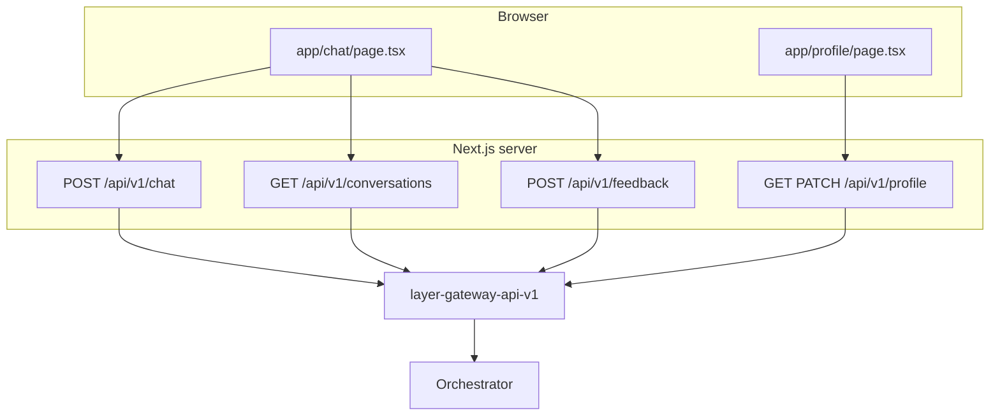

# HuntAI Web — Design

Next.js **App Router** app: chat UI plus a small **BFF** that proxies to **layer-gateway-api-v1** only. It does not talk to the orchestrator or models directly.

Authoritative gateway contracts: [layer-gateway-api-v1 `docs/schema.md`](../../layer-gateway-api-v1/docs/schema.md) (sibling repo).

---

## Architecture



**Trust boundary:** Production assumes **per-user JWT** (`AUTH_MODE=jwt`): the browser sends a short-lived access token via `Authorization` after login/SSO (see [auth-design.md](auth-design.md)). The server env **`GATEWAY_BEARER_TOKEN`** is a fallback when the browser sends no bearer (local stub dev, or tightly scoped service use — avoid sharing one token for all humans in production).

---

## Responsibilities

### Chat UI (`app/chat/page.tsx`)

- Renders conversation, streaming assistant text, inline rewrite above the answer, collapsible follow-up chip buttons directly below the answer (collapsed by default), then citations/trace in Details, user message edit (ChatGPT-style branch), feedback affordances.
- **ChatGPT-style sidebar** ([`app/components/ChatSidebar.tsx`](../app/components/ChatSidebar.tsx)): lists persisted threads after sign-in; **New chat** starts a fresh thread; selecting a thread loads messages from the gateway.
- **`sessionStorage`:** `layer_chat_session_id` for `X-Session-Id`; **`layer_active_conversation_id`** for the current thread UUID (from gateway); optional **`layer_bearer_token`** → `Authorization` (overrides cookie). **Auth:** **`/login`** and **`/signup`** set an httpOnly **`layer_access_token`** cookie (see [auth-design.md](auth-design.md)).
- Sends `conversation_id` / `X-Conversation-Id` on each message when a thread is active; stores gateway-returned `conversation_id` from JSON or `stream_end`.
- Generates `X-Request-Id` and `X-Trace-Id` per outbound `/api/v1/chat` request.
- Consumes the **BFF event stream**, not raw gateway SSE: `status`, `result_chunk`, `rewrite`, `stream_end`, `error`.

### BFF — conversation history

- **`GET /api/v1/conversations`** — proxies gateway list (newest `updated_at` first).
- **`GET /api/v1/conversations/[conversationId]/messages`** — loads one thread for the sidebar selection.

### BFF — `POST /api/v1/chat` (`app/api/v1/chat/route.ts`)

- Validates body (`message`, optional `conversation_id`, `history`).
- Resolves upstream bearer via [`app/lib/gateway-auth.ts`](../app/lib/gateway-auth.ts): **inbound `Authorization` first**, then `GATEWAY_BEARER_TOKEN`.
- Forwards to `POST {GATEWAY_BASE_URL}/v1/chat` with `Accept: text/event-stream`, `stream: true`, correlation headers, and JSON shaped per gateway contract.
- **Translates** gateway SSE (`meta`, `token`, `rewrite`, `done`, `error`) into the client-facing SSE/event shape used by `page.tsx`.
- Structured JSON logs: [`app/lib/server-log.ts`](../app/lib/server-log.ts); request/response summaries under `web_meta` in [`app/lib/web-log-payload.ts`](../app/lib/web-log-payload.ts).

### BFF — `POST /api/v1/feedback` (`app/api/v1/feedback/route.ts`)

- Maps UI fields to gateway feedback JSON (`run_id` → `trace_id`, etc.).
- Same bearer resolution as chat.

### BFF — `GET` / `PATCH` `/api/v1/profile` (`app/api/v1/profile/route.ts`)

- Proxies to gateway `GET /profile` and `PATCH /profile` with bearer from httpOnly session cookie ([`resolveGatewayBearer`](../app/lib/gateway-auth.ts)).
- PATCH whitelists user-editable fields only: `username`, `display_name`, `team`, `group` ([`app/lib/profile.ts`](../app/lib/profile.ts)).

### Profile UI (`app/profile/page.tsx`)

- Signed-in users edit profile fields; email, roles, and plan are read-only.
- Redirects to `/login?next=/profile` when unsigned.

---

## SSE translation (gateway → browser)

| Gateway event | BFF → client |
|---------------|----------------|
| `meta` | `status` (e.g. thinking) |
| `rewrite` | `rewrite` `{ text }` |
| `token` | `result_chunk` `{ delta }` |
| `done` | `stream_end` (answer text, citations, follow-ups, optional rewrite merge) |
| `error` | `error` |

Non-stream JSON responses from the gateway are handled as a separate path in the BFF and normalized for the client.

### Stream render (chat UI)

| BFF response to the browser | Stream render assistant text? |
|-----------------------------|-------------------------------|
| **SSE** (`Content-Type: text/event-stream`) | **Yes.** `app/chat/page.tsx` reads `fetch`’s `Response.body` with `getReader()`, parses BFF SSE frames, and appends each `result_chunk` `{ delta }` to the in-flight assistant message so the answer grows token-by-token. |
| **JSON** (`application/json`, e.g. BFF normalized gateway JSON) | **No.** The UI applies the full `response` string once after the body is parsed. |

Parsing helpers: [`app/lib/gateway-chat.ts`](../app/lib/gateway-chat.ts).

### Verifying SSE with curl (gateway vs Next BFF)

Use **`curl -N`** so stdout is not buffered and you see events as they arrive.

| Target | URL (example) | Event names on the wire |
|--------|----------------|-------------------------|
| **Gateway** (`layer-gateway-api-v1`) | `http://<gateway-host>:<port>/v1/chat` | `meta`, `rewrite`, `route`, `token`, `done`, `error` |
| **Next.js BFF** (this app) | `http://<web-host>:<port>/api/v1/chat` | `status`, `rewrite`, `result_chunk`, `stream_end`, `error` |

- **Gateway smoke curls** (full request shape, correlation headers): sibling repo [`docs/smoke-test.md`](../../layer-gateway-api-v1/docs/smoke-test.md).
- **Next BFF** expects a **smaller JSON body** from the browser: `message`, optional `conversation_id`, optional `history` (the BFF adds `stream: true` and gateway metadata when calling upstream). Example against local web:

```bash
curl -N -sS -X POST "http://localhost:3000/api/v1/chat" \
  -H "Authorization: Bearer demo-token" \
  -H "Content-Type: application/json" \
  -H "X-Session-Id: curl-web-sess-1" \
  -H "X-Request-Id: curl-web-req-1" \
  -H "X-Trace-Id: curl-web-trace-1" \
  -d '{"message":"Hello from curl via Next","conversation_id":"conv-curl-1"}'
```

Expect `Content-Type: text/event-stream` and lines like `event: status`, `event: result_chunk`, `event: stream_end` (not `meta` / `token` / `done`). With gateway **`AUTH_MODE=stub`**, use the same bearer as `GATEWAY_BEARER_TOKEN` (e.g. `demo-token`). With **`AUTH_MODE=jwt`**, use a **valid user access token** in `Authorization: Bearer`.

**One `token` / one `result_chunk`:** the upstream may emit a single chunk for a short answer, so the UI still uses the stream path but visually updates once. Longer prompts may produce many chunks; if the gateway still sends one `token` event, chunking is decided upstream (orchestrator / LLM), not by Next.

---

## Auth (gateway + web)

Full bearer resolution, trust boundaries, errors, and **production JWT per-user** model: **[docs/auth-design.md](auth-design.md)**.

| Gateway `AUTH_MODE` | Typical web setup | Result |
|---------------------|-------------------|--------|
| **`jwt` (production)** | Per-user JWT via **`/login`** session cookie and/or `layer_bearer_token` after your IdP | Gateway verifies JWT; **per-user** orchestrator `auth` from claims. |
| **`jwt`** | Only `GATEWAY_BEARER_TOKEN` set to a service JWT, no browser bearer | Single service identity for all users (only if intentional). |
| **`jwt`** | `demo-token` / missing JWT, no client bearer | **401** from gateway. |
| `stub` (local dev) | `GATEWAY_BEARER_TOKEN=demo-token`; browser often sends no bearer | Any non-empty bearer; identity from gateway `AUTH_STUB_*`. |
| `stub` | `sessionStorage.layer_bearer_token` set | Token forwarded; gateway still uses stub identity. |

**Production** uses **`jwt`** plus a **real access token** per user. Use **`/login`** or **`/signup`** (optional IdP link via **`AUTH_SIGNUP_URL`**), then paste token or **`POST /api/auth/session`**. Details: **[auth-design.md](auth-design.md)**.

See also: gateway [`docs/smoke-test.md`](../../layer-gateway-api-v1/docs/smoke-test.md) and [`README.md`](../../layer-gateway-api-v1/README.md) for `AUTH_MODE` and `AUTH_JWT_*`.

---

## Configuration (server-only)

| Variable | Purpose |
|----------|---------|
| `GATEWAY_BASE_URL` | Gateway origin, no trailing slash (default `http://localhost:8000` in code). |
| `GATEWAY_BEARER_TOKEN` | Fallback bearer when the browser sends no `Authorization`. **Production (per-user JWT):** often omitted for interactive users; required for typical **stub** local dev (`demo-token`). |
| `AUTH_SESSION_MAX_AGE_SECONDS` | Optional. Max-Age (seconds) for httpOnly session cookie after `/login` (default 8h in code). |
| `WEB_SERVICE_NAME` | JSON log field `service` (default `huntai-web`). |

Implemented in [`app/lib/config.ts`](../app/lib/config.ts). Copy [`.env.example`](../.env.example) to `.env` / `.env.local` per README.

## Observability

- One-line JSON logs aligned with gateway field order where practical (`ts`, `level`, `logger`, `phase`, `event`, `message`, correlation ids, `web_meta` payloads).
- Do not log raw secrets or full bearer tokens in application code paths; payloads in `web_meta` should follow redaction/truncation rules in `web-log-payload.ts`.

---

## Key source files

| Path | Role |
|------|------|
| `app/login/page.tsx` | Sign-in UI (`/login`) |
| `app/signup/page.tsx` | Sign-up UI (`/signup`); optional `AUTH_SIGNUP_URL` |
| `app/components/AccessTokenSessionForm.tsx` | Shared access token → session cookie |
| `app/components/DemoEnvLoginForm.tsx` | Shared demo email/password → `/api/auth/demo` |
| `app/api/v1/auth/config/route.ts` | `GET` exposes `demoLogin`, `signupUrl` |
| `app/api/v1/auth/logout/route.ts` | `POST` clears session cookie |
| `app/lib/auth-cookie.ts` | Cookie name + read helper for BFF |
| `app/chat/page.tsx` | Chat UI, streaming, edit/regenerate, feedback triggers |
| `app/api/v1/chat/route.ts` | Chat BFF, SSE pump, upstream fetch |
| `app/api/v1/feedback/route.ts` | Feedback BFF |
| `app/lib/gateway-auth.ts` | Bearer resolution for upstream |
| `app/lib/gateway-chat.ts` | Parse gateway SSE blocks, token/done payloads |
| `app/lib/chat-history.ts` | Client-side history + truncation for edit/regenerate |
| `app/lib/server-log.ts` | `logWebEvent` |
| `app/lib/web-log-payload.ts` | Log-safe request/response shapes |
| `app/lib/gateway-upstream-log.ts` | Merge gateway response headers into logs |

---

## Out of scope (this repo)

- Orchestrator, RAG, or LLM logic.
- Gateway-only features (JWT verification, inflight limits, orchestrator retries) — see **layer-gateway-api-v1**.
- Full **hosted IdP** OAuth/OIDC flows in this repo (use **`/login`**, **`/signup`**, or **`POST /api/auth/session`** after your IdP issues a token; see [auth-design.md](auth-design.md)).

---

## Related docs

- **README** — quick start, CI, Docker: [`README.md`](../README.md)
- **Auth design** — production JWT per-user, BFF bearer, stub dev: [`auth-design.md`](auth-design.md)
- **Gateway** — API schema, smoke tests, auth: sibling **layer-gateway-api-v1** `docs/`
