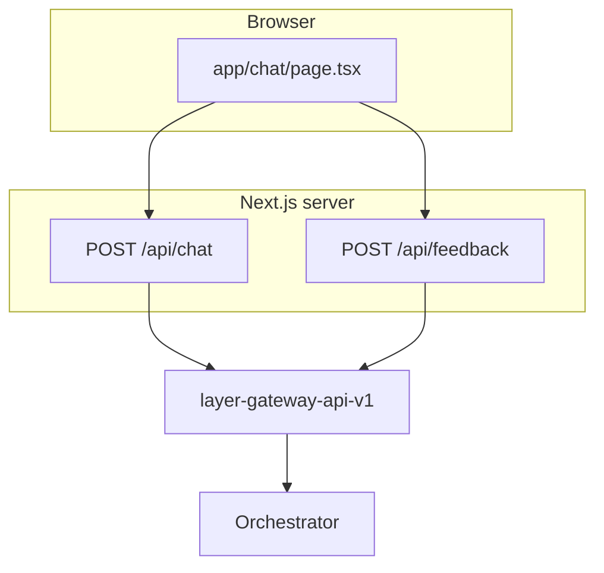

# huntAI Web — Design

Next.js **App Router** app: chat UI plus a small **BFF** that proxies to **layer-gateway-api-v1** only. It does not talk to the orchestrator or models directly.

Authoritative gateway contracts: [layer-gateway-api-v1 `docs/schema.md`](../../layer-gateway-api-v1/docs/schema.md) (sibling repo).

---

## Architecture

**Trust boundary:** The browser never holds long-lived gateway secrets. Optional short-lived access tokens may be passed via `Authorization` (see Auth below). Server env `GATEWAY_BEARER_TOKEN` is the fallback when the browser sends no bearer.

---

## Responsibilities

### Chat UI (`app/chat/page.tsx`)

- Renders conversation, streaming assistant text, citations, follow-up chips, user message edit (ChatGPT-style branch), feedback affordances.
- **`sessionStorage`:** `layer_chat_session_id` for `X-Session-Id`; optional `layer_bearer_token` forwarded as `Authorization: Bearer` when set (dev / future OIDC).
- Generates `X-Request-Id` and `X-Trace-Id` per outbound `/api/chat` request.
- Consumes the **BFF event stream**, not raw gateway SSE: `status`, `result_chunk`, `rewrite`, `stream_end`, `error`.

### BFF — `POST /api/chat` (`app/api/chat/route.ts`)

- Validates body (`message`, optional `conversation_id`, `history`).
- Resolves upstream bearer via [`app/lib/gateway-auth.ts`](../app/lib/gateway-auth.ts): **inbound `Authorization` first**, then `GATEWAY_BEARER_TOKEN`.
- Forwards to `POST {GATEWAY_BASE_URL}/api/chat` with `Accept: text/event-stream`, `stream: true`, correlation headers, and JSON shaped per gateway contract.
- **Translates** gateway SSE (`meta`, `token`, `rewrite`, `done`, `error`) into the client-facing SSE/event shape used by `page.tsx`.
- Structured JSON logs: [`app/lib/server-log.ts`](../app/lib/server-log.ts); request/response summaries under `web_meta` in [`app/lib/web-log-payload.ts`](../app/lib/web-log-payload.ts).

### BFF — `POST /api/feedback` (`app/api/feedback/route.ts`)

- Maps UI fields to gateway feedback JSON (`run_id` → `trace_id`, etc.).
- Same bearer resolution as chat.

---

## SSE translation (gateway → browser)

| Gateway event | BFF → client |
|---------------|----------------|
| `meta` | `status` (e.g. thinking) |
| `rewrite` | `rewrite` `{ text }` |
| `token` | `result_chunk` `{ delta }` |
| `done` | `stream_end` (answer text, citations, follow-ups, optional rewrite merge) |
| `error` | `error` |

Non-stream JSON responses from the gateway are handled as a separate path in the BFF and normalized for the client.

Parsing helpers: [`app/lib/gateway-chat.ts`](../app/lib/gateway-chat.ts).

---

## Auth (gateway + web)

| Gateway `AUTH_MODE` | Typical web setup | Result |
|---------------------|-------------------|--------|
| `stub` | `GATEWAY_BEARER_TOKEN=demo-token`; browser often sends no bearer | Works: gateway accepts any non-empty bearer; identity from gateway `AUTH_STUB_*`. |
| `stub` | `sessionStorage.layer_bearer_token` set | Token forwarded; gateway still uses stub identity. |
| `jwt` | Valid JWT in `layer_bearer_token` or in `GATEWAY_BEARER_TOKEN` | Gateway verifies JWT; orchestrator `auth` from claims. |
| `jwt` | Only `demo-token`, no real JWT | **401** from gateway. |

There is **no OIDC login UI** in this repo yet; production typically adds a session layer and sets `layer_bearer_token` (or passes bearer another way).

See also: gateway [`docs/smoke-test.md`](../../layer-gateway-api-v1/docs/smoke-test.md) and [`README.md`](../../layer-gateway-api-v1/README.md) for `AUTH_MODE` and `AUTH_JWT_*`.

---

## Configuration (server-only)

| Variable | Purpose |
|----------|---------|
| `GATEWAY_BASE_URL` | Gateway origin, no trailing slash (default `http://localhost:8000` in code). |
| `GATEWAY_BEARER_TOKEN` | Fallback bearer when the incoming request has no non-empty `Authorization: Bearer`. |
| `WEB_SERVICE_NAME` | JSON log field `service` (default `huntai-web`). |

Implemented in [`app/lib/config.ts`](../app/lib/config.ts). Copy [`.env`](../.env) / `.env.local` pattern per README.

---

## Observability

- One-line JSON logs aligned with gateway field order where practical (`ts`, `level`, `logger`, `phase`, `event`, `message`, correlation ids, `web_meta` payloads).
- Do not log raw secrets or full bearer tokens in application code paths; payloads in `web_meta` should follow redaction/truncation rules in `web-log-payload.ts`.

---

## Key source files

| Path | Role |
|------|------|
| `app/chat/page.tsx` | Chat UI, streaming, edit/regenerate, feedback triggers |
| `app/api/chat/route.ts` | Chat BFF, SSE pump, upstream fetch |
| `app/api/feedback/route.ts` | Feedback BFF |
| `app/lib/gateway-auth.ts` | Bearer resolution for upstream |
| `app/lib/gateway-chat.ts` | Parse gateway SSE blocks, token/done payloads |
| `app/lib/chat-history.ts` | Client-side history + truncation for edit/regenerate |
| `app/lib/server-log.ts` | `logWebEvent` |
| `app/lib/web-log-payload.ts` | Log-safe request/response shapes |
| `app/lib/gateway-upstream-log.ts` | Merge gateway response headers into logs |

---

## Out of scope (this repo)

- Orchestrator, RAG, or LLM logic.
- Gateway-only features (JWT verification, inflight limits, orchestrator retries) — see **layer-gateway-api-v1**.
- Full OIDC / NextAuth integration (future).

---

## Related docs

- **README** — quick start, CI, Docker: [`README.md`](../README.md)
- **Gateway** — API schema, smoke tests, auth: sibling **layer-gateway-api-v1** `docs/`
